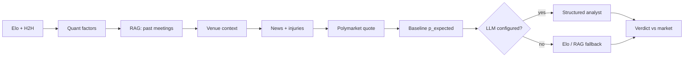
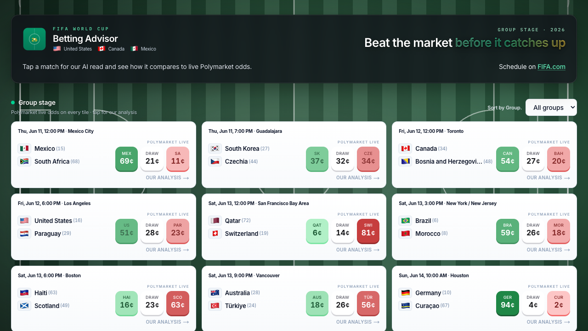
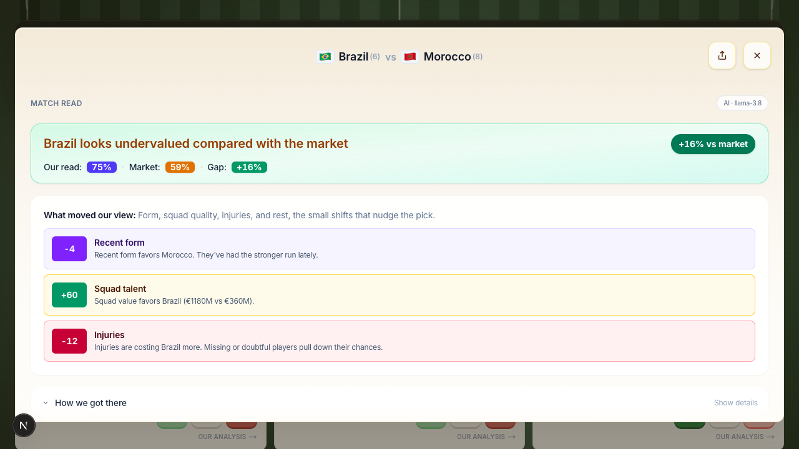

# MatchDiff

Next.js dashboard for the 2026 World Cup group stage. Match tiles show live [Polymarket](https://polymarket.com/sports/fifa-world-cup/games) win prices; tap a fixture to open MatchDiff vs the market and the data behind it.

[FAQ](/faq) · [Quick start](#quick-start)

---

## What it does

1. **Lists group-stage fixtures** with kickoff, venue, FIFA rank, and Polymarket home / draw / away prices (¢).
2. **Runs analysis on demand** when you open a match: quantitative baseline, context retrieval, optional news, then an LLM pass when configured.
3. **Compares MatchDiff to the market** in the modal: headline verdict, MatchDiff vs Market vs Gap, factor breakdown, and collapsible detail (ratings, venue, H2H, news).

Works without API keys for the grid, Elo baseline, and Google News RSS. Add Groq, Gemini, or Ollama when you want full LLM-written match reads.

---

## How it works

### In the browser

```
Dashboard → GET /api/matches (fixtures + Polymarket prices)
         → filter by group
         → tap tile → POST /api/analyze → analysis modal
```

Share a match with `?match=<fixture-id>` in the URL.

### On the server (`lib/alpha-engine.ts`)

Each `POST /api/analyze` call builds context, then optionally refines the probability with an LLM:



| Input | Role |
|-------|------|
| **Elo + H2H** | Home-win probability baseline from `data/processed/elo-ratings.json` and head-to-head adjustment |
| **Quant factors** | Rest days, recent form, squad value, injuries → signed Elo deltas (`lib/model-factors.ts`) |
| **RAG** | Direct head-to-head rows from processed match history (`lib/rag-search.ts`) |
| **Venue** | Altitude, climate, travel from WC26 host-city data (`lib/match-context.ts`) |
| **News** | Google News RSS by default; optional GNews / NewsAPI |
| **Polymarket** | Live three-way prices via Gamma API |
| **LLM** | Structured output (Zod): `p_expected`, headline, steps, risks (`lib/llm-analyst.ts`) |

Without an LLM, the response uses **Elo + RAG blend** or **Elo baseline** and labels the source on the payload (`p_expected_source`).

### Offline evaluation

`npm run eval` benchmarks Elo, H2H, RAG blend, and factor variants on `data/results.csv`. Output goes to `data/evals/latest.json` (gitignored).

---

## Screenshots

**Match grid** — group filter and Polymarket prices on each tile.

<p align="center">
  
</p>

**Analysis modal** — verdict, market comparison, and detail sections.

<p align="center">
  
</p>

---

## Quick start

```bash
git clone <your-repo-url>
cd wc26-alpha-agent
npm install
cp .env.example .env.local   # optional
npm run dev
```

Open [http://localhost:3000](http://localhost:3000).

Optional local LLM:

```bash
ollama pull llama3.2
# .env.local: LLM_PROVIDER=ollama
```

---

## Secrets

Never commit `.env.local` or paste keys into the repo. Copy variable names from `.env.example` only.

| Variable | Purpose |
|----------|---------|
| `GROQ_API_KEY` / `LLM_PROVIDER=groq` | Hosted LLM (default when key is set) |
| `GOOGLE_GENERATIVE_AI_API_KEY` | Gemini |
| `LLM_PROVIDER=ollama` | Local Ollama |
| `FOOTBALL_DATA_ORG_TOKEN` | Live schedule from football-data.org |
| `GNEWS_API_KEY` / `NEWS_API_KEY` | Optional news upgrades |
| `ANALYZE_RATE_LIMIT_*` | Per-IP limits on `/api/analyze` |

Build history data from Kaggle:

```bash
npm run data:build -- --file data/results.csv
```

---

## API

| Route | Method | Description |
|-------|--------|-------------|
| `/api/matches` | GET | Fixtures + Polymarket prices |
| `/api/analyze` | POST | Full analysis for one match |

**`POST /api/analyze`** (required: `home`, `away`, `kickoff_iso`):

Optional: `p_market`, `market_draw`, `market_away_win`, `polymarket_event_slug`, `venue`, `include_llm`, `include_sentiment`, `refresh_sentiment`.

Response fields include `p_expected`, `p_expected_source`, `p_market`, `edge`, `verdict`, `breakdown`, `adjustments`, `rag`, `sentiment`, `llm`.

---

## Scripts

```bash
npm run dev
npm run build
npm run typecheck
npm test
npm run data:build -- --file data/results.csv
npm run wc26:venues
npm run news:check
npm run sentiment:ingest
npm run eval
```

---

## Layout

```
app/           Dashboard, match grid, analysis modal, API routes
lib/           alpha-engine, model factors, RAG, LLM, sentiment
data/          fixtures, processed ratings/RAG, curated overrides
data/processed/llm-cache/     gitignored
data/processed/sentiment-cache/  gitignored
data/evals/    gitignored
docs/          README screenshots
```

---

## FAQ

See [/faq](/faq) for questions about MatchDiff, Polymarket prices, the analysis pipeline, and disclaimers.

---

This is for informational purposes only and does not constitute financial, investment, or legal advice. AI-generated analysis may contain errors. Past performance does not guarantee future results. You can lose your entire investment. Always do your own research and consult a qualified financial advisor. We do not facilitate trades or hold funds.

Polymarket is a third-party market; this project is not affiliated with FIFA or Polymarket.
